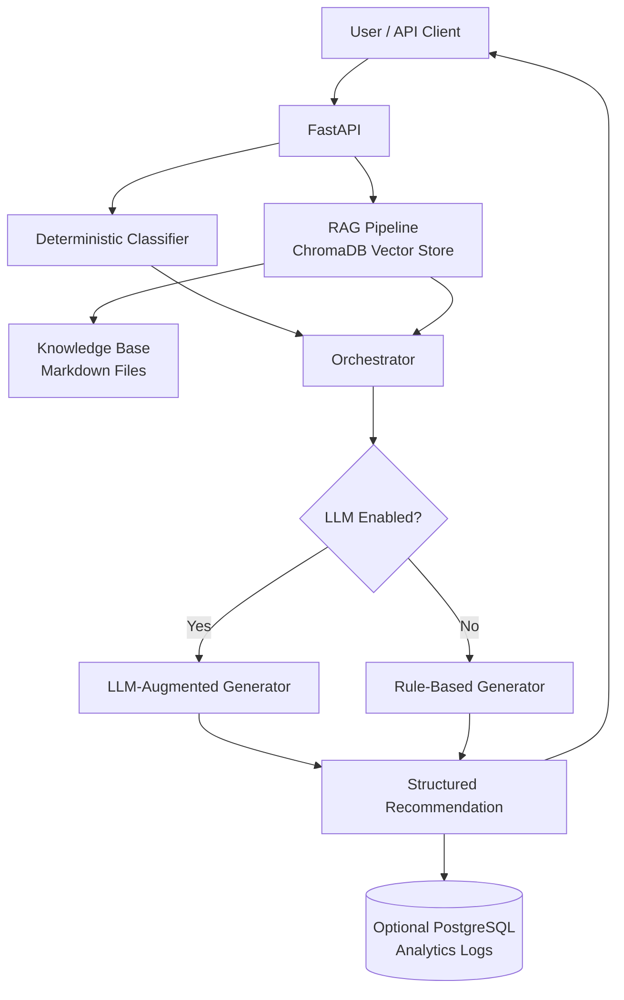

# AI IT Support Assistant

[](https://www.python.org/downloads/)
[](https://fastapi.tiangolo.com/)
[](https://www.trychroma.com/)
[](https://platform.openai.com/)
[](https://www.docker.com/)
[](https://opensource.org/licenses/MIT)

---

## 📋 Table of Contents

- [Overview](#overview)
- [Features](#features)
- [Example Request & Response](#example-request--response)
- [Architecture](#architecture)
- [Project Structure](#project-structure)
- [Installation](#installation)
  - [Local (Offline Mode)](#local-offline-mode)
  - [Docker (API + PostgreSQL)](#docker-api--postgresql)
- [Configuration](#configuration)
  - [Enabling LLM-Augmented Generation](#enabling-llm-augmented-generation)
  - [Enabling PostgreSQL Logging](#enabling-postgresql-logging)
- [API Endpoints](#api-endpoints)
- [Testing](#testing)
- [Evaluation](#evaluation)
- [Reindexing the Knowledge Base](#reindexing-the-knowledge-base)
- [Future Roadmap](#future-roadmap)
- [Contributing](#contributing)
- [Author](#author)
- [License](#license)

---

## 📖 Overview

A **RAG-backed API** that classifies IT support issues, retrieves grounded context from an internal knowledge base, and returns a structured troubleshooting recommendation — including probable cause, steps, relevant commands, severity, escalation guidance, and the sources used.

**Key Differentiators**:
- **Offline-first**: Runs fully offline out of the box (no API keys required).
- **Pluggable AI**: Upgrades to LLM-augmented generation and PostgreSQL-backed analytics with a couple of environment variables.
- **Self-Contained**: Includes a ChromaDB vector store over a Markdown knowledge base, with a hashing‑based embedding vectorizer by default.
- **Production-ready**: Dockerized, fully tested, and ready for extension.

---

## ✨ Features

- **FastAPI REST API** – interactive OpenAPI docs at `/docs`.
- **Deterministic Classifier** – assigns category, severity, confidence, escalation policy.
- **RAG Pipeline** – ChromaDB vector store over a Markdown knowledge base, with pluggable embedding backend (offline hashing vectorizer by default; OpenAI embeddings optional).
- **Optional LLM Augmentation** – supports any OpenAI‑compatible endpoint (OpenAI, Azure, local vLLM/Ollama, etc.) with automatic fallback to the deterministic generator if the LLM is unavailable.
- **Optional PostgreSQL Logging** – logs every analysis for evaluation and auditing.
- **Dockerized** – API + Postgres via `docker-compose`.
- **Automated Testing** – `pytest` covers classifier, RAG grounding, API, and LLM fallback.
- **Evaluation Script** – runs a labeled issue set and generates an evaluation report.

---

## 📬 Example Request & Response

### Request

```json
POST /support/analyze
{
  "issue": "My Windows laptop cannot connect to Wi-Fi."
}
```

### Response

```json
{
  "issue": "My Windows laptop cannot connect to Wi-Fi.",
  "analysis": {
    "category": "network",
    "severity": "medium",
    "confidence": 0.9,
    "probable_cause": "Network connectivity or configuration issue.",
    "recommended_steps": [
      "Check whether Airplane Mode is disabled.",
      "Restart the Wi-Fi adapter.",
      "Forget and reconnect to the Wi-Fi network.",
      "Run the Windows network troubleshooter.",
      "Restart the router if other devices are also affected."
    ],
    "relevant_commands": [
      "ipconfig /all",
      "ipconfig /release",
      "ipconfig /renew",
      "ipconfig /flushdns"
    ],
    "escalation_required": false,
    "escalation_reason": null,
    "sources": [
      {
        "source": "network_issues.md",
        "snippet": "## Initial Troubleshooting\n1. Check whether Airplane Mode is disabled...",
        "relevance_score": 0.61
      }
    ],
    "generated_by": "rule_based"
  }
}
```

---

## 🧭 Architecture



Full design rationale: [`docs/architecture.md`](docs/architecture.md).

---

## 📁 Project Structure

```plaintext
ai-it-support-assistant/
│
├── app/
│   ├── api/               # FastAPI route definitions
│   ├── config/            # Environment-driven settings
│   ├── rag/               # Loader, embeddings, ChromaDB vector store
│   ├── services/          # Classifier, LLM client, orchestrator
│   ├── models/            # Pydantic schemas
│   ├── db/                # SQLAlchemy models + session (optional Postgres logging)
│   └── main.py            # Application entry point
│
├── data/
│   └── knowledge_base/    # Markdown IT documentation (ingested into the vector store)
│
├── docker/
│   └── Dockerfile
├── docker-compose.yml
├── docs/
│   ├── architecture.md    # Technical decisions and design rationale
│   └── evaluation.md      # Evaluation results
│
├── scripts/
│   └── evaluate.py        # Evaluation script
│
├── tests/                 # Automated tests
│
├── .env.example           # Environment variable template
├── requirements.txt
└── README.md
```

---

## ⚙️ Installation

### Local (Offline Mode)

No API keys required – works fully offline.

```bash
# Clone the repository
git clone https://github.com/Baqir110/ai-it-support-assistant.git
cd ai-it-support-assistant

# Create and activate a virtual environment
python -m venv .venv
source .venv/bin/activate        # Windows: .venv\Scripts\activate

# Install dependencies
pip install -r requirements.txt

# (Optional) Copy environment defaults
cp .env.example .env

# Start the server
uvicorn app.main:app --reload
```

API documentation will be available at: [http://127.0.0.1:8000/docs](http://127.0.0.1:8000/docs)

### Docker (API + PostgreSQL)

For a production-like environment with logging.

```bash
docker compose up --build
```

---

## 🔧 Configuration

The application is configured via environment variables (see `.env.example`).

| Variable               | Description | Default |
|------------------------|-------------|---------|
| `EMBEDDING_BACKEND`    | `hashing` (offline) or `openai` | `hashing` |
| `LLM_PROVIDER`         | `none` or `openai` | `none` |
| `OPENAI_API_KEY`       | Required if `LLM_PROVIDER=openai` | – |
| `LLM_MODEL`            | Model name (e.g., `gpt-4o-mini`) | `gpt-4o-mini` |
| `OPENAI_BASE_URL`      | Custom endpoint (e.g., local vLLM) | `https://api.openai.com/v1` |
| `POSTGRES_DSN`         | Optional PostgreSQL connection string | – |

### Enabling LLM-Augmented Generation

Set in `.env` or the environment:

```bash
LLM_PROVIDER=openai
OPENAI_API_KEY=sk-...
LLM_MODEL=gpt-4o-mini
```

For local models (e.g., via Ollama), set `OPENAI_BASE_URL`:

```bash
OPENAI_BASE_URL=http://localhost:11434/v1
LLM_MODEL=llama3
```

Check `GET /health` to confirm `llm_enabled: true`.

### Enabling PostgreSQL Logging

Set the `POSTGRES_DSN` environment variable to a valid PostgreSQL connection string. The system will automatically create the required tables and log every analysis request.

---

## 🌐 API Endpoints

| Method | Endpoint                  | Description                                 |
|--------|---------------------------|---------------------------------------------|
| GET    | `/`                       | API status                                  |
| GET    | `/health`                 | Health check (shows LLM status, DB status)  |
| POST   | `/support/analyze`        | Analyze an IT support issue                 |
| POST   | `/knowledge-base/reindex` | Force a full rebuild of the vector store    |

---

## 🧪 Testing

Run the automated test suite:

```bash
pytest
```

**Test coverage** includes:
- Deterministic classifier's rule set
- RAG retrieval and grounding
- LLM fallback path
- API endpoints (end-to-end)

---

## 📊 Evaluation

A script evaluates the system on a labeled set of 25 cases (including ambiguous ones) through the real classifier + RAG pipeline.

```bash
python scripts/evaluate.py
```

Results are written to [`docs/evaluation.md`](docs/evaluation.md).

**Current results**:
- **84%** classification accuracy
- **96%** escalation-flag accuracy
- **70%** retrieval hit-rate

> *The retrieval hit-rate is the clearest argument for upgrading `EMBEDDING_BACKEND` to `openai` in a real deployment – see [Technical decisions](docs/architecture.md#technical-decisions) for why it defaults to an offline hashing vectorizer.*

---

## 🔄 Reindexing the Knowledge Base

The vector store automatically ingests new/changed Markdown files in `data/knowledge_base/` on startup.

To force a full rebuild at runtime:

```bash
curl -X POST http://127.0.0.1:8000/knowledge-base/reindex
```

---

## 🗺️ Future Roadmap

- [ ] Web interface for end‑user interaction
- [ ] Multi‑language knowledge base support
- [ ] Active learning for classification improvement
- [ ] Integration with ticketing systems

---

## 🤝 Contributing

Contributions are welcome! Please follow these steps:

1. Fork the repository
2. Create a feature branch (`git checkout -b feature/amazing-feature`)
3. Commit your changes (`git commit -m 'Add amazing feature'`)
4. Push to the branch (`git push origin feature/amazing-feature`)
5. Open a Pull Request

---

## 👤 Author

**Muhammad Baqir**  
M.Sc. Software Systems Science

**Interests**:
- AI & Data Science
- Software Engineering
- Backend Development
- IT Support Systems
- Intelligent Systems

---

## 📄 License

This project is licensed under the MIT License – see the [LICENSE](LICENSE) file for details.

---

<p align="center">
  Made with ❤️ and 🐍 Python
</p>

<p align="center">
  ⭐ Star this repository if you find it useful!
</p>
